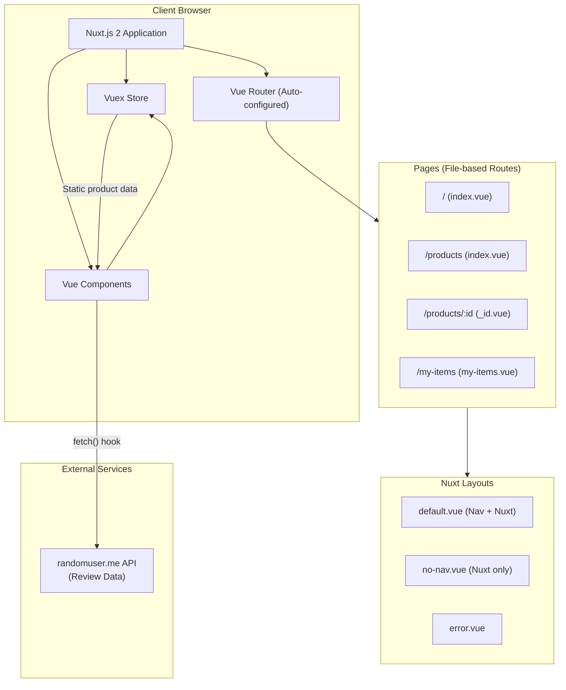
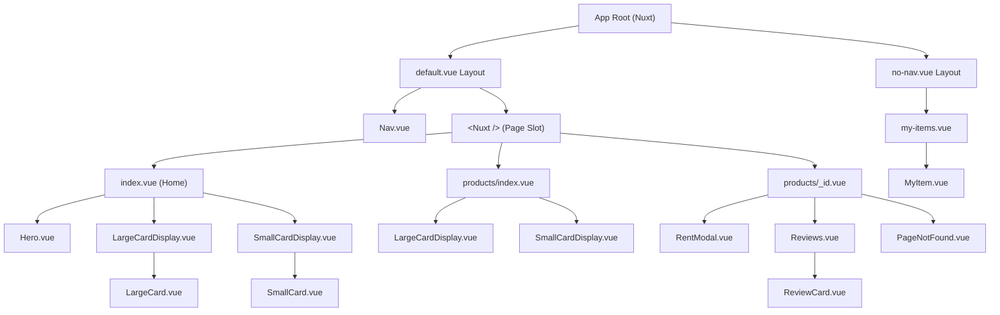
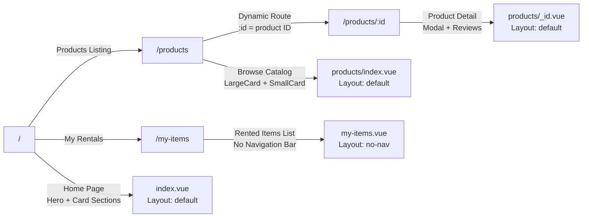
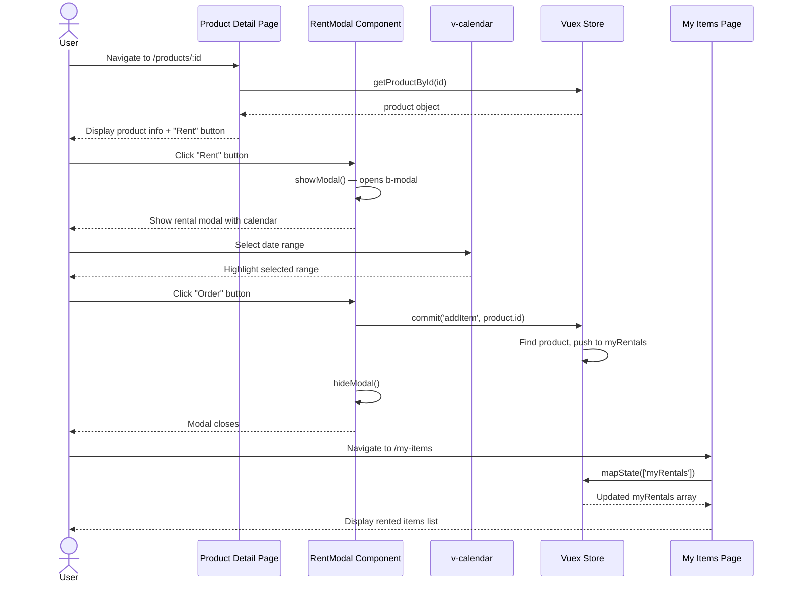
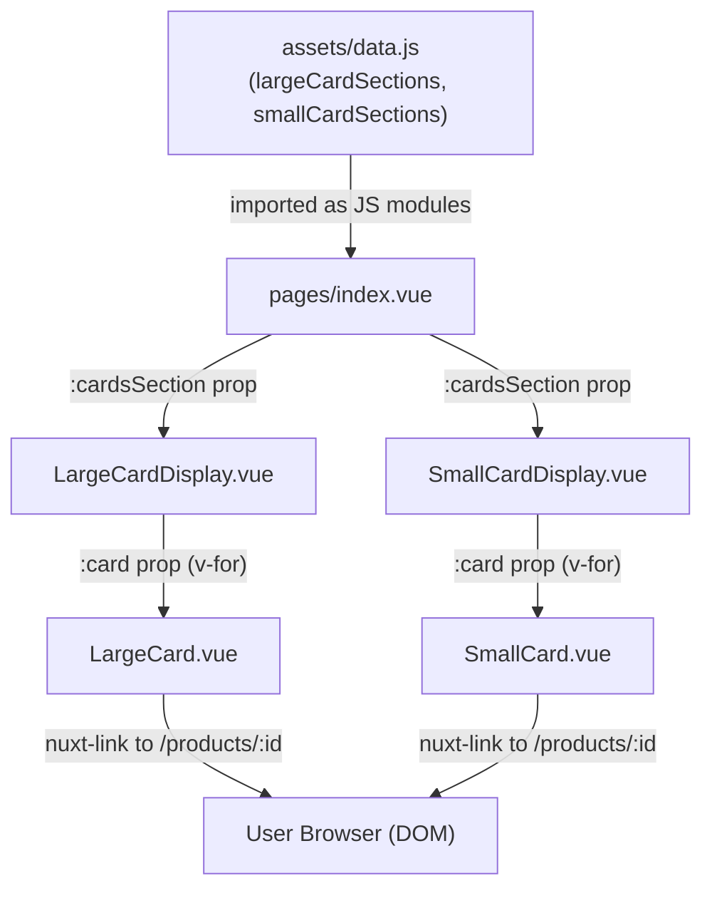
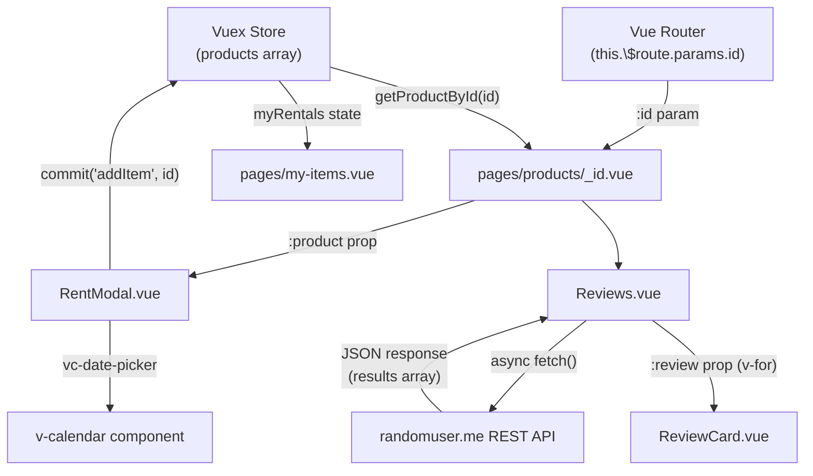
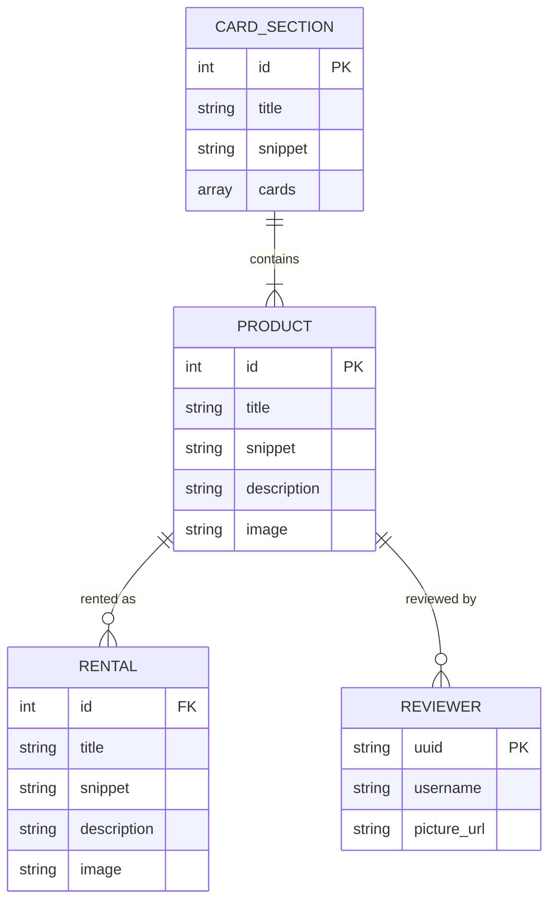
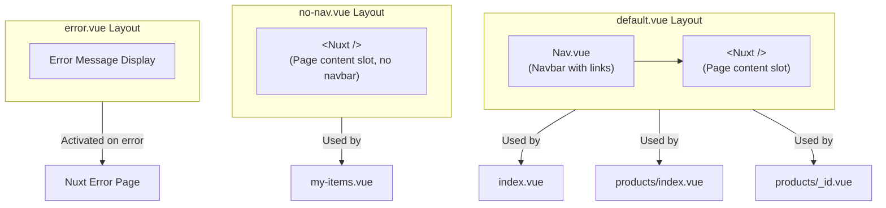

# FIRENGII — FIRE EXTINGUISHER RENTAL & E-COMMERCE PLATFORM

**Final Year Project Documentation**
School of Computer Science
National College of Business Administration & Economics, Lahore, Pakistan
2025

---

## TABLE OF CONTENTS

- [Dedication](#dedication)
- [Acknowledgment](#acknowledgment)
- [Abstract](#abstract)
- [List of Figures](#list-of-figures)
- [List of Tables](#list-of-tables)
- [List of Abbreviations](#list-of-abbreviations)
- [Chapter 1: Introduction](#chapter-1-introduction)
- [Chapter 2: Literature Review](#chapter-2-literature-review)
- [Chapter 3: System Design and Methodology](#chapter-3-system-design-and-methodology)
- [Chapter 4: Implementation and Development](#chapter-4-implementation-and-development)
- [Chapter 5: Results and Discussion](#chapter-5-results-and-discussion)
- [Conclusion](#conclusion)
- [Future Work](#future-work)
- [References](#references)
- [Appendices](#appendices)

---

## DEDICATION

	This work is dedicated to my parents, whose unconditional love and tireless sacrifices have made every achievement in my life possible. To my teachers and mentors, whose guidance and patience transformed challenges into lessons, and to all those who believe that technology can be harnessed to make communities safer and better equipped to face emergencies.

---

## ACKNOWLEDGMENT

	I would like to express my sincere gratitude to my project supervisor for their continuous support, guidance, and constructive feedback throughout the development of this project. Their expertise in web application development significantly shaped the outcome of this work.

	I am also grateful to the faculty of the School of Computer Science at NCBA&E, Lahore, for providing an academic environment that nurtures innovation and practical learning. Special thanks to my fellow students and the open-source community whose tools, libraries, and documentation made the technical implementation of this project possible.

	Finally, I acknowledge the creators of Nuxt.js, Vue.js, and Bootstrap-Vue — frameworks whose well-maintained ecosystems allowed rapid and structured development.

---

## ABSTRACT

	Firengii is a web-based fire extinguisher rental and e-commerce platform developed using the Nuxt.js framework on top of Vue.js. The platform enables users to browse a curated catalog of fire extinguishers, view detailed product information, select rental dates using an integrated calendar, submit rental orders, and review their rented items. The system is built as a Single-Page Application (SPA) with Server-Side Rendering (SSR) capabilities enabled through Nuxt.js version 2.

	The application employs Vuex as its centralized state management solution, managing a catalog of twenty-four distinct fire extinguisher products alongside user rental records. The user interface is constructed using Bootstrap-Vue, providing a responsive and accessible design suitable for desktop and mobile browsers. Third-party integrations include the v-calendar library for date range selection, vue-js-modal for overlay dialogs, and the Random User API for dynamic review content.

	The project follows a component-based architecture, consisting of eleven reusable Vue components organized across three page layouts. This documentation describes the complete system design, component hierarchy, data flow, state management model, routing structure, and implementation details, supported by software architecture diagrams produced in Mermaid notation.

**Keywords:** Nuxt.js, Vue.js, Vuex, Fire Extinguisher, Rental Platform, Single-Page Application, Server-Side Rendering, Bootstrap-Vue, Component Architecture.

---

## LIST OF FIGURES

| Figure | Title |
|--------|-------|
| FIGURE 3.1 | High-Level System Architecture |
| FIGURE 3.2 | Component Hierarchy Diagram |
| FIGURE 3.3 | Application Routing Structure |
| FIGURE 3.4 | Vuex State Management Flow |
| FIGURE 3.5 | Rental Order Sequence Diagram |
| FIGURE 3.6 | Data Flow Diagram — Home Page |
| FIGURE 3.7 | Data Flow Diagram — Product Detail Page |
| FIGURE 3.8 | Entity Relationship Diagram (Data Model) |
| FIGURE 3.9 | Layout and Page Structure |
| FIGURE 4.1 | Project Directory Structure |

---

## LIST OF TABLES

| Table | Title |
|-------|-------|
| TABLE 1.1 | System Objectives Summary |
| TABLE 2.1 | Comparison of Frontend Frameworks |
| TABLE 3.1 | Vuex State Properties |
| TABLE 3.2 | Vuex Mutations |
| TABLE 3.3 | Vuex Getters |
| TABLE 3.4 | Application Routes |
| TABLE 3.5 | Component Descriptions |
| TABLE 4.1 | Project Dependencies |
| TABLE 4.2 | Development Dependencies |
| TABLE 5.1 | Feature Verification Checklist |

---

## LIST OF ABBREVIATIONS

| Abbreviation | Full Form |
|---|---|
| SPA | Single-Page Application |
| SSR | Server-Side Rendering |
| API | Application Programming Interface |
| UI | User Interface |
| UX | User Experience |
| CSS | Cascading Style Sheets |
| HTML | HyperText Markup Language |
| JS | JavaScript |
| VCS | Version Control System |
| NPM | Node Package Manager |
| DOM | Document Object Model |
| VDOM | Virtual Document Object Model |
| REST | Representational State Transfer |
| JSON | JavaScript Object Notation |

---

## CHAPTER 1 INTRODUCTION

### 1.1 PROJECT OVERVIEW

	Firengii is a modern, fully responsive fire extinguisher rental and e-commerce web application developed as part of a Final Year Project. The platform's name, Firengii, is a portmanteau combining "fire" and a colloquial suffix, evoking a sense of familiarity and urgency appropriate to its safety-focused domain.

	The application serves as a digital marketplace where users can discover, evaluate, and rent different categories of fire extinguishers. In a world where fire safety compliance is mandatory for commercial premises and increasingly advisable for residential properties, a digital platform that simplifies access to fire suppression equipment addresses a genuine and growing market need.

	The front end of the system is entirely built with Nuxt.js 2, a progressive framework that augments Vue.js with conventions for routing, layouts, server-side rendering, and code splitting. The result is a performant, SEO-friendly, and maintainable codebase that follows Vue.js single-file component conventions.

### 1.2 PROBLEM STATEMENT

	Access to appropriate fire safety equipment remains inconsistent across both residential and commercial sectors. Many property owners either lack awareness of the variety of fire extinguisher types available (dry powder, water mist, CO2, wet chemical, clean agent, etc.) or find it difficult to identify the correct type for their specific fire risk class.

	Moreover, purchasing high-end fire extinguishers is cost-prohibitive for many small businesses and homeowners. A rental model lowers the barrier to entry, ensures equipment is regularly inspected and up to date, and removes the burden of long-term ownership.

	Existing fire safety e-commerce platforms tend to be static, difficult to navigate, and do not offer rental workflows. Firengii addresses these gaps by providing an intuitive digital catalog with a streamlined rental order process.

### 1.3 OBJECTIVES

	The objectives of the Firengii platform are as follows:

	1. To design and implement a responsive, component-based web application for browsing fire extinguisher products.
	2. To provide detailed product pages for each extinguisher, including title, description, and imagery.
	3. To implement a date-range-based rental ordering system integrated with a calendar user interface.
	4. To maintain a user-specific list of rented items accessible through a dedicated My Items page.
	5. To integrate customer review functionality using an external public API.
	6. To ensure the application performs correctly across desktop and mobile viewports.
	7. To follow Nuxt.js best practices including layout management, Vuex state, and file-based routing.

**TABLE 1.1** System Objectives Summary

| # | Objective | Implementation Approach |
|---|-----------|------------------------|
| 1 | Product Catalog | Vuex state, LargeCard & SmallCard components |
| 2 | Product Detail | Dynamic route `/products/_id.vue`, Vuex getter |
| 3 | Rental Ordering | RentModal with v-calendar and Vuex mutation |
| 4 | My Items Page | `/my-items.vue`, Vuex `myRentals` state |
| 5 | Customer Reviews | Async fetch from randomuser.me API |
| 6 | Responsive Design | Bootstrap-Vue grid and flex utilities |
| 7 | Nuxt.js Best Practices | Layouts, file-based routing, Vuex module |

### 1.4 SCOPE

	The scope of this project covers the design and development of the client-side portion of the Firengii platform. This includes:

- A home page with a hero section, featured large-card product sections, and small-card product grids.
- A products listing page showing the full catalog.
- Individual product detail pages with image, description, and rental modal.
- A "My Items" page displaying all rented products.
- A navigation bar for site-wide routing.
- Client-side state management for products and rental history.
- Integration with the Random User Generator API for review data.

	The project does not include a backend server, database, user authentication, payment processing, or an administrative dashboard. These components are identified as future work.

### 1.5 SYSTEM ARCHITECTURE OVERVIEW

	The Firengii application follows a client-centric architecture built on the JAMstack philosophy (JavaScript, APIs, Markup). The Nuxt.js framework manages server-side rendering at build time and client-side navigation at runtime. Vuex provides a single source of truth for application state, while Vue Router — auto-configured by Nuxt.js — manages navigation between pages.

	Third-party APIs (randomuser.me) are consumed directly from the browser using the Fetch API. The application does not expose or consume any proprietary REST services; all product data is embedded in the Vuex store as static JavaScript objects to simulate a real database-backed catalog.

---

## CHAPTER 2 LITERATURE REVIEW

### 2.1 WEB APPLICATION DEVELOPMENT EVOLUTION

	The evolution of web application development has shifted dramatically from traditional server-rendered multi-page applications (MPAs) to client-rendered single-page applications (SPAs) and, most recently, to hybrid approaches that combine the best of both worlds through frameworks like Next.js (React) and Nuxt.js (Vue).

	In the early phase of web development, all rendering was performed on the server. HTML pages were generated fresh with each HTTP request, resulting in full page reloads on every navigation. While functionally complete, this model produced poor perceived performance and heavy server load.

	The introduction of AJAX (Asynchronous JavaScript and XML) in the mid-2000s enabled partial page updates without full reloads. Libraries like jQuery abstracted browser inconsistencies, enabling richer interactivity. However, maintaining large jQuery codebases became increasingly difficult as applications grew in complexity.

### 2.2 COMPONENT-BASED FRAMEWORKS

	Modern JavaScript frameworks introduced the component model, where the UI is broken into self-contained, reusable units each encapsulating their own template, logic, and styles. React (Facebook, 2013), Angular (Google, 2016), and Vue.js (Evan You, 2014) are the three dominant frameworks following this paradigm.

**TABLE 2.1** Comparison of Frontend Frameworks

| Feature | React | Angular | Vue.js / Nuxt.js |
|---------|-------|---------|-----------------|
| Language | JSX + JS | TypeScript | JavaScript / TypeScript |
| Architecture | Component | MVC | Component + MVVM |
| Learning Curve | Moderate | High | Low |
| SSR Support | Next.js | Angular Universal | Nuxt.js (built-in) |
| State Management | Redux / Zustand | NgRx | Vuex / Pinia |
| Bundle Size | Medium | Large | Small-Medium |
| Community | Very Large | Large | Large |
| File-based Routing | Next.js | No | Nuxt.js (built-in) |

	Firengii was built using Vue.js and Nuxt.js. Vue.js was chosen for its gentle learning curve, excellent documentation, and expressive single-file component format. Nuxt.js was chosen as the meta-framework to provide project structure, automatic routing, server-side rendering, and a build pipeline without manual configuration.

### 2.3 NUXT.JS FRAMEWORK

	Nuxt.js is an open-source framework built on top of Vue.js that provides server-side rendering, static site generation, and hybrid rendering modes. Version 2 of Nuxt.js, used in this project, is built on Vue 2 and relies on Vue Router 3 and Vuex 3.

	Key Nuxt.js 2 conventions relevant to this project include:

- **File-based Routing**: Every `.vue` file placed in the `pages/` directory automatically becomes a route. Dynamic routes are created using underscore-prefixed filenames (e.g., `_id.vue`).
- **Layouts**: The `layouts/` directory defines wrapper components for pages. The `default.vue` layout wraps all pages unless overridden.
- **Auto-imports**: Components placed in the `components/` directory are automatically imported and available globally when `components: true` is set in `nuxt.config.js`.
- **Vuex Integration**: A `store/index.js` file automatically activates Vuex in the application.
- **Async Data Fetching**: The `fetch()` hook in Nuxt.js allows asynchronous data fetching within components, with support for SSR.

### 2.4 VUEX STATE MANAGEMENT

	Vuex is the official state management library for Vue.js applications. It implements the Flux architectural pattern, where application state is stored in a centralized "store" and mutated only through strictly defined mutations. Actions can handle asynchronous operations before committing mutations.

	Vuex's four core concepts are:
- **State**: The single source of truth — a reactive data tree accessible from any component.
- **Mutations**: Synchronous functions that modify the state. They are the only way to change state in Vuex.
- **Actions**: Asynchronous operations that can commit mutations after completing (e.g., API calls).
- **Getters**: Computed properties derived from the state, accessible from components.

	In Firengii, the store manages the `products` array (24 items) and the `myRentals` array (user's rented items). A single mutation (`addItem`) adds a product to rentals. A getter (`getProductById`) retrieves a single product by its ID for the detail page.

### 2.5 BOOTSTRAP AND BOOTSTRAP-VUE

	Bootstrap is the most widely used CSS framework in the world. Bootstrap-Vue is an implementation of Bootstrap 4 components as native Vue.js components, providing accessible, responsive UI primitives such as modals, navigation bars, buttons, cards, and grid systems without requiring manual jQuery manipulation.

	In Firengii, Bootstrap-Vue provides the `b-modal` component used in the rental flow, the `b-button` component, and the responsive grid through its container and flex utilities.

### 2.6 RELATED SYSTEMS

	Several commercial platforms operate in the fire safety equipment space, including FireSafetyUSA, FireExtinguisher.com, and various local safety equipment suppliers. These platforms typically focus on direct sales rather than rentals and often lack modern UI/UX patterns. No major platform has been identified that provides a rental-first, responsive, component-based interface for fire extinguishers — supporting the novelty of the Firengii concept.

---

## CHAPTER 3 SYSTEM DESIGN AND METHODOLOGY

### 3.1 HIGH-LEVEL SYSTEM ARCHITECTURE

	Firengii follows a Nuxt.js universal application architecture. The system does not include a dedicated backend server; instead it combines static product data embedded in Vuex with a third-party REST API for review data. The following diagram illustrates the top-level architecture.

**FIGURE 3.1** High-Level System Architecture



### 3.2 COMPONENT HIERARCHY DIAGRAM

	The Firengii application is structured around eleven reusable Vue components. The hierarchy below shows parent-child relationships from the root layout down to the leaf-level display components.

**FIGURE 3.2** Component Hierarchy Diagram



### 3.3 APPLICATION ROUTING STRUCTURE

	Nuxt.js automatically generates Vue Router configuration from the `pages/` directory. The routing tree for Firengii is described below.

**FIGURE 3.3** Application Routing Structure



**TABLE 3.4** Application Routes

| Route Path | File | Layout | Description |
|------------|------|--------|-------------|
| `/` | `pages/index.vue` | default | Home page with hero and featured product sections |
| `/products` | `pages/products/index.vue` | default | Full product catalog listing |
| `/products/:id` | `pages/products/_id.vue` | default | Individual product detail page |
| `/my-items` | `pages/my-items.vue` | no-nav | User's rented items list |

### 3.4 VUEX STATE MANAGEMENT DESIGN

	The application uses a single Vuex module defined in `store/index.js`. The store acts as the sole source of truth for all product data and the user's rental history.

**FIGURE 3.4** Vuex State Management Flow

```mermaid
stateDiagram-v2
    [*] --> InitialState: App Boot

    state InitialState {
        products: Product[24]
        myRentals: Rental[1]
    }

    InitialState --> UserBrowses: User visits /products
    UserBrowses --> UserViewsDetail: User clicks product card
    UserViewsDetail --> ModalOpen: User clicks "Rent" button
    ModalOpen --> DateSelected: User selects date range
    DateSelected --> OrderConfirmed: User clicks "Order"
    OrderConfirmed --> MutationFired: addItem(productId) mutation called
    MutationFired --> UpdatedState: myRentals array updated

    state UpdatedState {
        products: Product[24]
        myRentals: Rental[1..n]
    }

    UpdatedState --> MyItemsPage: User navigates to /my-items
    MyItemsPage --> [*]: Displays updated rental list
```

**TABLE 3.1** Vuex State Properties

| Property | Type | Initial Value | Description |
|----------|------|---------------|-------------|
| `products` | `Array<Product>` | 24 product objects | Complete fire extinguisher catalog |
| `myRentals` | `Array<Product>` | 1 sample rental | Products the user has rented |

**TABLE 3.2** Vuex Mutations

| Mutation | Parameters | Description |
|----------|------------|-------------|
| `addItem` | `(state, id)` | Finds product by ID and pushes it to `myRentals` |

**TABLE 3.3** Vuex Getters

| Getter | Parameters | Returns | Description |
|--------|------------|---------|-------------|
| `getProductById` | `(state) => (id)` | `Product` or `undefined` | Curried getter that returns a single product matching the given ID |

### 3.5 RENTAL ORDER SEQUENCE DIAGRAM

	The following sequence diagram illustrates the complete user flow for submitting a rental order, from clicking "Rent" on a product detail page to the rental appearing in the "My Items" list.

**FIGURE 3.5** Rental Order Sequence Diagram



### 3.6 DATA FLOW DIAGRAMS

**FIGURE 3.6** Data Flow Diagram — Home Page



**FIGURE 3.7** Data Flow Diagram — Product Detail Page



### 3.7 ENTITY RELATIONSHIP DIAGRAM (DATA MODEL)

	Although Firengii does not use a persistent database, the logical data model represented in the Vuex store can be described as follows.

**FIGURE 3.8** Entity Relationship Diagram (Data Model)



### 3.8 LAYOUT AND PAGE STRUCTURE

**FIGURE 3.9** Layout and Page Structure



### 3.9 COMPONENT DESCRIPTIONS

**TABLE 3.5** Component Descriptions

| Component | File | Props | Description |
|-----------|------|-------|-------------|
| `Nav` | `Nav.vue` | None | Site-wide navigation bar with links to Home, Products, My Items |
| `Hero` | `Hero.vue` | None | Landing page hero section with headline and CTA button |
| `LargeCardDisplay` | `LargeCardDisplay.vue` | `cardsSection` | Section wrapper that renders a title, snippet, and list of LargeCards |
| `SmallCardDisplay` | `SmallCardDisplay.vue` | `cardsSection` | Section wrapper that renders a title and grid of SmallCards |
| `LargeCard` | `LargeCard.vue` | `card` | Displays a single product as a large card (image, title, snippet) with navigation link |
| `SmallCard` | `SmallCard.vue` | `card` | Displays a single product as a compact image-only card with navigation link |
| `RentModal` | `RentModal.vue` | `product` | Overlay modal with a calendar for date selection and an Order button that triggers the Vuex `addItem` mutation |
| `Reviews` | `Reviews.vue` | None | Fetches 5 random users from the Random User API and renders ReviewCard components |
| `ReviewCard` | `ReviewCard.vue` | `review` | Displays a single review with user avatar, username, and review text |
| `MyItem` | `MyItem.vue` | `item` | Displays a single rented item in the My Items page with image, title, and description |
| `PageNotFound` | `PageNotFound.vue` | None | Displayed on the product detail page when no product is found for the given ID |

---

## CHAPTER 4 IMPLEMENTATION AND DEVELOPMENT

### 4.1 DEVELOPMENT ENVIRONMENT

	The Firengii client application was developed using the following environment:

- **Operating System**: Any (macOS / Windows / Linux)
- **Node.js**: v14.x or later
- **Package Manager**: npm (v6.x or later)
- **Framework**: Nuxt.js 2.14.12
- **Vue.js**: 2.x (peer dependency of Nuxt 2)
- **Editor**: Visual Studio Code (recommended) with Vetur extension for Vue syntax support
- **Browser**: Google Chrome (development), Firefox and Safari (cross-browser testing)
- **Version Control**: Git

	To run the project locally, the following commands are used:

```bash
# Navigate to the Client directory
cd Client

# Install all dependencies
npm install

# Start the development server with hot-module replacement
npm run dev
# Application runs at http://localhost:3000

# Build for production
npm run build
npm run start

# Generate static site output
npm run generate
```

### 4.2 PROJECT STRUCTURE

**FIGURE 4.1** Project Directory Structure

```
Nuxt-Crash-Course/
└── Client/
    ├── assets/
    │   ├── data.js            # Static card section data
    │   ├── images/            # Product images (fe1.jpg … fe25.jpg)
    │   └── svg/
    │       └── fire-extinguisher.svg
    ├── components/
    │   ├── Hero.vue
    │   ├── LargeCard.vue
    │   ├── LargeCardDisplay.vue
    │   ├── MyItem.vue
    │   ├── Nav.vue
    │   ├── PageNotFound.vue
    │   ├── RentModal.vue
    │   ├── ReviewCard.vue
    │   ├── Reviews.vue
    │   ├── SmallCard.vue
    │   └── SmallCardDisplay.vue
    ├── layouts/
    │   ├── default.vue        # Includes Nav + page slot
    │   ├── error.vue          # Error page layout
    │   └── no-nav.vue         # Bare layout (no navbar)
    ├── middleware/            # Nuxt middleware (empty)
    ├── pages/
    │   ├── index.vue          # Home page
    │   ├── my-items.vue       # My Rentals page
    │   └── products/
    │       ├── index.vue      # Product listing
    │       └── _id.vue        # Product detail (dynamic)
    ├── plugins/
    │   ├── vue-calendar.js    # v-calendar plugin registration
    │   ├── vue-js-modal.js    # vue-js-modal plugin registration
    │   └── vue-star-rating.js # vue-star-rating plugin registration
    ├── static/
    │   └── favicon.ico
    ├── store/
    │   └── index.js           # Vuex state, mutations, getters
    ├── test/
    │   └── Logo.spec.js       # Jest unit test
    ├── .babelrc               # Babel configuration
    ├── .editorconfig          # Editor formatting rules
    ├── jest.config.js         # Jest test configuration
    ├── nuxt.config.js         # Nuxt application configuration
    └── package.json           # NPM dependencies and scripts
```

### 4.3 DEPENDENCIES

**TABLE 4.1** Project Dependencies

| Package | Version | Purpose |
|---------|---------|---------|
| `nuxt` | ^2.14.12 | Core framework — routing, SSR, build pipeline |
| `bootstrap` | ^4.5.3 | CSS framework for responsive grid and utilities |
| `bootstrap-vue` | ^2.21.2 | Vue-native Bootstrap components (modals, buttons, etc.) |
| `core-js` | ^3.8.2 | JavaScript polyfills for older browsers |
| `v-calendar` | ^2.2.0 | Calendar and date picker component |
| `vue-js-modal` | ^2.0.0-rc.6 | Plugin for programmatic Vue modals |
| `vue-star-rating` | ^1.7.0 | Star rating display component |

**TABLE 4.2** Development Dependencies

| Package | Version | Purpose |
|---------|---------|---------|
| `@vue/test-utils` | ^1.1.2 | Vue component testing utilities |
| `babel-core` | 7.0.0-bridge.0 | Babel bridge for Jest compatibility |
| `babel-jest` | ^26.6.3 | Babel transformer for Jest |
| `jest` | ^26.6.3 | JavaScript test runner |
| `vue-jest` | ^3.0.4 | Vue single-file component transformer for Jest |

### 4.4 NUXT CONFIGURATION

	The `nuxt.config.js` file is the central configuration file for the Nuxt.js application. The key configurations in Firengii are:

- **Head metadata**: Sets the HTML `<title>` to "Client", includes UTF-8 charset, viewport meta, and favicon link.
- **External scripts**: Includes Popper.js, jQuery slim, and Bootstrap JS from CDN for Bootstrap component functionality.
- **Plugins**: Registers `vue-js-modal` in server mode and `vue-calendar` in client-only mode (since it requires browser APIs).
- **Components auto-import**: Enabled with `components: true`, allowing all components in the `components/` directory to be used without explicit imports in page files.
- **Modules**: Includes `bootstrap-vue/nuxt` to integrate Bootstrap-Vue as a Nuxt module.
- **Build transpile**: Transpiles `vue-star-rating` through Babel to ensure compatibility.

### 4.5 ROUTING IMPLEMENTATION

	Nuxt.js generates Vue Router configuration automatically. The `pages/` directory maps directly to application routes:

- `pages/index.vue` → `/`
- `pages/products/index.vue` → `/products`
- `pages/products/_id.vue` → `/products/:id`
- `pages/my-items.vue` → `/my-items`

	The dynamic route `_id.vue` uses `this.$route.params.id` to retrieve the product identifier, which is passed to the Vuex getter `getProductById` as a curried function call:

```javascript
computed: {
    product() {
        return this.$store.getters.getProductById(this.$route.params.id);
    }
}
```

	If no product is found for the given ID, the component renders the `PageNotFound` component via `v-if` / `v-else` conditional rendering.

### 4.6 STATE MANAGEMENT IMPLEMENTATION

	The Vuex store in `store/index.js` exports three named exports following the Nuxt.js classic module convention:

**State Factory Function:**
```javascript
export const state = () => ({
    myRentals: [ /* initial rental */ ],
    products: [ /* 24 product objects */ ]
})
```

	Note that the state is exported as a factory function (arrow function returning an object) rather than a plain object. This is required by Vuex in Nuxt.js to ensure each server-side render gets a fresh state instance, preventing state contamination between requests.

**Mutation:**
```javascript
export const mutations = {
    addItem(state, id) {
        let item = state.products.find(product => product.id == id)
        state.myRentals.push(item)
    }
}
```

**Getter:**
```javascript
export const getters = {
    getProductById: (state) => (id) => {
        return state.products.find(product => product.id == id)
    }
}
```

	The getter uses currying (a function returning a function) so that it can accept a dynamic argument (`id`) when called from a component. This is the standard Vuex pattern for parameterized getters.

### 4.7 COMPONENT IMPLEMENTATION DETAILS

#### 4.7.1 Hero Component

	The `Hero.vue` component renders the landing page header section. It contains a bold headline ("Find your Fire Extinguisher"), a descriptive snippet, a "Start Looking" call-to-action button, and an SVG illustration of a fire extinguisher. The component uses scoped CSS with flexbox to place the text container and image side by side. A media query adjusts the hero height for screens narrower than 500px.

#### 4.7.2 LargeCard and SmallCard Components

	Two card presentation formats are used across the application:

- **LargeCard** (`LargeCard.vue`): Displays an image at 65% height, product title, and snippet. Width is set to 31.5% to allow three cards per row. Wraps content in a `nuxt-link` to the product detail page.
- **SmallCard** (`SmallCard.vue`): Displays only an image at full dimensions, width of 24% for a four-per-row grid. Also wraps in a `nuxt-link`.

	Both components receive a `card` prop containing `id`, `image`, `title`, and `snippet` fields. Images are loaded using Webpack's `require()` with a dynamic path expression, falling back to `fe1.jpg` if the `image` property is absent.

#### 4.7.3 RentModal Component

	The `RentModal.vue` component uses Bootstrap-Vue's `b-modal` component with a programmatic show/hide interface via `this.$refs['my-modal'].show()` and `hide()`. It accepts the `product` prop and imports the `addItem` mutation via Vuex's `mapMutations` helper.

	The modal body contains a `vc-date-picker` from the `v-calendar` library configured for date-range selection with a dark color theme. The "Order" button calls both `addItem(product.id)` and `hideModal()` in sequence, completing the rental flow.

	The `vue-js-modal` plugin is also registered (in `plugins/vue-js-modal.js`) and loaded in server mode, providing an alternative programmatic modal API that can be used in future enhancements.

#### 4.7.4 Reviews Component

	The `Reviews.vue` component uses Nuxt.js's component-level `fetch()` hook to asynchronously load five random user profiles from the Random User Generator API (`https://randomuser.me/api/?results=5`). The hook is called both on the server during SSR and on the client during navigation. The fetched results are iterated with `v-for` and each reviewer is passed to a `ReviewCard` component.

#### 4.7.5 My Items Page

	The `my-items.vue` page uses the `no-nav` layout, removing the navigation bar for a focused item-list view. It accesses the `myRentals` array from the Vuex store using `mapState` from Vuex. Each rental is rendered using the `MyItem` component which displays the product image, title, and description in a horizontal flex layout.

### 4.8 PLUGIN REGISTRATIONS

	Three plugins are registered in `nuxt.config.js`:

1. **vue-js-modal** (`plugins/vue-js-modal.js`): Loaded in `server` mode. This makes the modal plugin available during SSR for any server-rendered modal interactions.

2. **v-calendar** (`plugins/vue-calendar.js`): Loaded in `client` mode only. Because `v-calendar` uses browser-specific APIs (DOM, `window`), it must not be executed in the Node.js SSR environment.

3. **vue-star-rating** (`plugins/vue-star-rating.js`): The star-rating component is also registered as a plugin and added to the `build.transpile` list in `nuxt.config.js` to ensure it is compiled by Babel for cross-browser compatibility.

---

## CHAPTER 5 RESULTS AND DISCUSSION

### 5.1 SYSTEM FEATURES AND VERIFICATION

	All planned features of the Firengii platform were successfully implemented. The table below summarizes each feature and its verification status.

**TABLE 5.1** Feature Verification Checklist

| # | Feature | Component(s) | Status |
|---|---------|-------------|--------|
| 1 | Home page hero section | `Hero.vue`, `index.vue` | ✅ Implemented |
| 2 | Featured large-card product sections on home page | `LargeCardDisplay.vue`, `LargeCard.vue` | ✅ Implemented |
| 3 | Small-card product grid on home and products pages | `SmallCardDisplay.vue`, `SmallCard.vue` | ✅ Implemented |
| 4 | Full product catalog listing page | `products/index.vue` | ✅ Implemented |
| 5 | Individual product detail page with dynamic routing | `products/_id.vue` | ✅ Implemented |
| 6 | Rental modal with date-range calendar | `RentModal.vue`, `v-calendar` | ✅ Implemented |
| 7 | Add rented item to Vuex store | `addItem` mutation | ✅ Implemented |
| 8 | My Items page displaying rented products | `my-items.vue`, `MyItem.vue` | ✅ Implemented |
| 9 | Customer reviews from external API | `Reviews.vue`, `ReviewCard.vue` | ✅ Implemented |
| 10 | 404 / Product Not Found handling | `PageNotFound.vue` | ✅ Implemented |
| 11 | Responsive navigation bar | `Nav.vue`, Bootstrap-Vue | ✅ Implemented |
| 12 | Multiple layouts (default, no-nav, error) | `layouts/` directory | ✅ Implemented |

### 5.2 PAGE-BY-PAGE RESULTS

#### 5.2.1 Home Page (`/`)

	The home page renders successfully with the Hero component at the top, followed by one or more `LargeCardDisplay` sections featuring groupings of fire extinguisher products. Below those, `SmallCardDisplay` sections show a dense grid of product thumbnails. All product images load from the local `assets/images/` directory and all navigation links function correctly.

#### 5.2.2 Products Page (`/products`)

	The products page shows the first large-card section (sliced to the first element with `.slice(0,1)`) followed by all small-card sections. This provides a clean browseable catalog. Every product card is a clickable link that navigates to the correct detail page.

#### 5.2.3 Product Detail Page (`/products/:id`)

	The product detail page correctly retrieves the product matching the URL parameter using the Vuex getter. The page displays:
- A hero layout with the product image (59% width) and an information box (39% width).
- The product title and snippet in the info box.
- A "Rent" button that opens the rental modal.
- A "What's Included" section with four feature highlights.
- A full description paragraph.
- A customer reviews section fetched from the Random User API.

	When an invalid ID is provided in the URL, the `v-else` branch renders the `PageNotFound` component as expected.

#### 5.2.4 My Items Page (`/my-items`)

	The My Items page renders each rented product in a horizontal flex card showing the product image, title, and description. The initial state contains one pre-seeded rental. Additional rentals appear immediately after completing the rental modal flow, confirming that Vuex reactivity is working correctly.

### 5.3 PERFORMANCE CONSIDERATIONS

	Because Nuxt.js renders pages on the server before sending them to the browser, the initial page load is fast and SEO-friendly. Subsequent navigation uses client-side routing for near-instant transitions.

	The `v-calendar` plugin is loaded in client-only mode, preventing unnecessary SSR overhead. Image files are served from the `static/` and `assets/` directories and are optimized for web delivery by the Nuxt.js Webpack build pipeline.

	Code splitting is handled automatically by Nuxt.js — each page and its direct dependencies are bundled into separate chunks, reducing initial payload size for users navigating to any single route.

### 5.4 TESTING

	The project includes a Jest test suite configured in `jest.config.js`. The configuration:

- Maps `@/` and `~/` aliases to the project root.
- Transforms `.vue` files using `vue-jest` and `.js` files using `babel-jest`.
- Collects coverage from all files in `components/` and `pages/`.

	A sample test (`test/Logo.spec.js`) verifies that a component mounts as a valid Vue instance using `@vue/test-utils`. Additional unit tests can be added for all components following the same pattern.

	Tests are run with:

```bash
npm run test
```

### 5.5 LIMITATIONS

	The current implementation has the following known limitations:

1. **No persistent storage**: Vuex state is in-memory only. Refreshing the browser resets all rental history.
2. **No user authentication**: Any visitor can "rent" any product with no identity verification.
3. **No payment integration**: The rental flow does not include any billing or payment processing.
4. **Static product data**: Products are hardcoded in the Vuex store rather than fetched from a dynamic API or database.
5. **Placeholder reviews**: Review text is generic Lorem Ipsum content; only reviewer names and avatars come from the API.
6. **No date validation**: The calendar allows date selection but the selected dates are not stored or validated.

---

## CONCLUSION

	Firengii is a fully functional, component-based fire extinguisher rental and e-commerce web application built with Nuxt.js 2, Vue.js, Vuex, and Bootstrap-Vue. The project successfully demonstrates the implementation of a modern SPA with SSR capabilities, file-based routing, centralized state management, third-party plugin integration, and a responsive UI.

	The application's architecture — eleven reusable components, four pages, three layouts, and a centralized Vuex store — follows Vue.js and Nuxt.js best practices. The component hierarchy is clean and maintainable, with clear prop-based communication between parent and child components and Vuex-based communication for shared state.

	The project fulfills all stated objectives: users can browse a catalog of twenty-four fire extinguisher products, view individual product details, submit rental orders with date selection, view their rented items, and read customer reviews sourced from a live external API.

	This project serves as a strong foundation for a production-grade fire safety equipment rental platform and demonstrates competency in modern JavaScript frontend development.

---

## FUTURE WORK

	The following enhancements are recommended for future development iterations:

1. **Backend API Integration**: Replace static Vuex data with a RESTful or GraphQL backend (e.g., Node.js/Express, Django, or Laravel) connected to a relational database such as PostgreSQL or MySQL.

2. **User Authentication**: Implement JWT-based authentication with registration and login flows. Libraries such as `@nuxtjs/auth-next` provide ready-to-use Nuxt.js authentication modules.

3. **Payment Gateway**: Integrate Stripe or PayPal to process rental payments. The rental modal would be extended to collect billing information and confirm payment before adding items to `myRentals`.

4. **Persistent State**: Replace in-memory Vuex state with API-backed persistence so that rental history survives page refreshes and is user-specific.

5. **Search and Filter**: Add a search bar and category/type filter to the products listing page to help users find the appropriate extinguisher type for their fire class.

6. **Admin Dashboard**: A separate authenticated admin interface for managing products, inventory, rental orders, and customer accounts.

7. **Nuxt.js 3 Migration**: Migrate the project to Nuxt.js 3 (built on Vue 3 and Vite) for improved performance, Composition API support, and better TypeScript integration. Replace Vuex with Pinia.

8. **Push Notifications**: Implement browser push notifications using the Web Push API or a service like Firebase Cloud Messaging to remind users of upcoming rental return dates.

9. **Real Reviews**: Replace the Random User API integration with a real review system where authenticated users can submit star ratings and text reviews for products they have rented.

10. **Progressive Web App (PWA)**: Add a service worker using `@nuxtjs/pwa` to enable offline browsing of previously loaded product pages.

---

## REFERENCES

1. Chopin, S., & Lachgar, Y. (2018). *Nuxt.js: Vue.js on Steroids*. Packt Publishing.
2. Evan You. (2014). *Vue.js: The Progressive JavaScript Framework*. Retrieved from https://vuejs.org/
3. Nuxt.js Team. (2021). *Nuxt.js 2 Documentation*. Retrieved from https://v2.nuxt.com/
4. Vuex Team. (2021). *Vuex 3 — State Management for Vue.js*. Retrieved from https://v3.vuex.vuejs.org/
5. Bootstrap-Vue Team. (2021). *Bootstrap-Vue Documentation*. Retrieved from https://bootstrap-vue.org/
6. Nathan Schwartz et al. (2020). *v-calendar Documentation*. Retrieved from https://v-calendar.io/
7. Random User Generator API. (2021). Retrieved from https://randomuser.me/
8. Flanagan, D. (2020). *JavaScript: The Definitive Guide* (7th ed.). O'Reilly Media.
9. Simpson, K. (2015). *You Don't Know JS: ES6 & Beyond*. O'Reilly Media.
10. Osmani, A. (2017). *Learning JavaScript Design Patterns*. O'Reilly Media.
11. MDN Web Docs. (2024). *JavaScript Fetch API*. Retrieved from https://developer.mozilla.org/en-US/docs/Web/API/Fetch_API
12. Vue Test Utils Team. (2021). *Vue Test Utils — Testing Vue.js Components*. Retrieved from https://v1.test-utils.vuejs.org/
13. Jest Team. (2021). *Jest: Delightful JavaScript Testing*. Retrieved from https://jestjs.io/
14. Twitter Bootstrap. (2021). *Bootstrap 4 Documentation*. Retrieved from https://getbootstrap.com/docs/4.6/
15. Higher Education Commission of Pakistan. (2020). *Plagiarism Policy*. Retrieved from https://www.hec.gov.pk/

---

## APPENDICES

### APPENDIX A — PRODUCT CATALOG

The Firengii platform ships with twenty-four pre-loaded fire extinguisher products in the Vuex store. The table below lists all products.

| ID | Title | Image File |
|----|-------|------------|
| 1 | Dry Powder Extinguisher | fe7.jpg |
| 2 | 2L Portable & Safe | fe8.jpg |
| 3 | 2L Portable & Safe | fe9.jpg |
| 4 | Cartridge Operated Dry Chemical Extinguisher | fe10.jpg |
| 5 | Clean Agent Fire Extinguisher | fe11.jpg |
| 6 | Water Mist | fe12.jpg |
| 7 | Clean Agent Fire Extinguisher | fe13.jpg |
| 8 | 2L Portable & Safe | fe14.jpg |
| 9 | Water & Foam Fire Extinguisher | fe15.jpg |
| 10 | Clean Agent Fire Extinguisher | fe16.jpg |
| 11 | Water Mist | fe17.jpeg |
| 12 | 2L Portable & Safe | fe18.jpg |
| 13 | Water Mist | fe19.jpg |
| 14 | Clean Agent | fe20.jpg |
| 15 | ABC Powder Fire Extinguisher | fe21.jpg |
| 16 | Carbon Dioxide Fire Extinguisher | fe22.jpg |
| 17 | Wet Chemical Fire Extinguisher | fe23.jpg |
| 18 | Dry Powder Extinguisher | fe24.jpg |
| 19 | Toronto's Portable 2L Fire Extinguisher | fe1.jpg |
| 20 | Empty Super Red Fire Extinguisher | fe2.jpg |
| 21 | Fire Extinguisher, Perfect for Pools | fe3.jpg |
| 22 | Vintage 1864 Fire Extinguisher | fe4.png |
| 23 | Pure Silver & Gold Fire Extinguisher | fe5.png |
| 24 | Two in One Fire Extinguisher | fe6.jpg |

### APPENDIX B — NUXT CONFIGURATION FILE

```javascript
export default {
  head: {
    title: 'Client',
    htmlAttrs: { lang: 'en' },
    meta: [
      { charset: 'utf-8' },
      { name: 'viewport', content: 'width=device-width, initial-scale=1' },
      { hid: 'description', name: 'description', content: '' }
    ],
    link: [{ rel: 'icon', type: 'image/x-icon', href: '/favicon.ico' }]
  },
  css: [],
  plugins: [
    { src: '~plugins/vue-js-modal.js', mode: 'server' },
    { src: '~plugins/vue-calendar.js', mode: 'client' },
  ],
  components: true,
  buildModules: [],
  modules: ['bootstrap-vue/nuxt'],
  build: {
    transpile: ['vue-star-rating']
  }
}
```

### APPENDIX C — JEST CONFIGURATION

```javascript
module.exports = {
  moduleNameMapper: {
    '^@/(.*)$': '<rootDir>/$1',
    '^~/(.*)$': '<rootDir>/$1',
    '^vue$': 'vue/dist/vue.common.js'
  },
  moduleFileExtensions: ['js', 'vue', 'json'],
  transform: {
    '^.+\\.js$': 'babel-jest',
    '.*\\.(vue)$': 'vue-jest'
  },
  collectCoverage: true,
  collectCoverageFrom: [
    '<rootDir>/components/**/*.vue',
    '<rootDir>/pages/**/*.vue'
  ]
}
```

### APPENDIX D — BUILD AND RUN COMMANDS

```bash
# Development
cd Client
npm install
npm run dev          # http://localhost:3000

# Production
npm run build
npm run start

# Static generation
npm run generate

# Testing
npm run test
```

---

*End of Documentation*

*Firengii — Fire Extinguisher Rental & E-Commerce Platform*
*School of Computer Science, NCBA&E Lahore, 2025*
